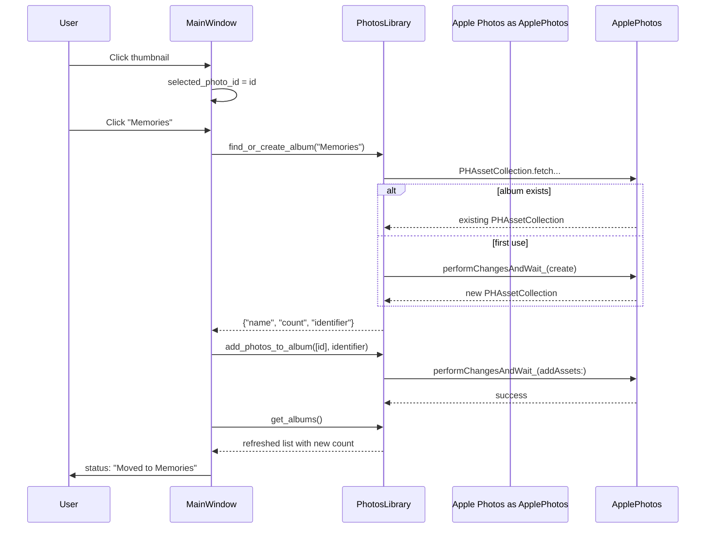

# Categorization

Apple Photos albums are the canonical store. There is no sidecar database,
no in-memory `photo_id -> category` dict, and no badge widget.

## The three categories

| Button label | Photos album name | Intended for |
|--------------|-------------------|--------------|
| Memories | `Memories` | Personal/family photos, events |
| Todo | `Todo` | Captured tasks, recipes, lists, diagrams |
| Research | `Research` | Reference material, documents, articles |

The label-to-album mapping lives in
[`src/photo_bomb/ui/main_window.py`](../src/photo_bomb/ui/main_window.py)
as `_CATEGORY_ALBUMS`. To add a category, append a button to the toolbar
in `_create_central_widget` and add an entry to that dict - no other
files change.

When AI analysis is re-introduced in Phase 2, the prompt text in
[`src/photo_bomb/core/api_client.py::analyze_photo`](../src/photo_bomb/core/api_client.py)
will need to be derived from the same dict to keep a single source of
truth. Today those prompt strings still hardcode the lowercase
`memories|todo|research` triple - harmless because the analyzer isn't
wired yet.

## How categorization works at runtime

## Why no badge widget

The UI was built around a coloured `CategoryBadge` overlaid on each tile.
With Apple Photos as the truth, the user can already see "is this in the
Memories album?" by clicking the album in the sidebar. An overlay would
require a per-photo album-membership query on every grid render - that's
expensive (one `PHAssetCollection` fetch per asset) and the data is
already one click away.

If overlays are wanted in the future, the right shape is:

1. After `get_photos_for_album`, do one batched
   `PHAsset.fetchAssetCollectionsContainingAsset_withType_options_` per
   page of photos.
2. Cache the result keyed by `localIdentifier` for the duration of the
   page.
3. Render a small coloured pill in `add_photo_item` based on the cached
   answer.

That's a Phase 2+ enhancement, not a Phase 1 requirement.

## Why no on-disk categorization cache

There would be exactly two reasons to add one:

- **Speed.** Apple Photos album membership is already cached in-memory
  by `Photos.framework`. A sidecar would be a strict downgrade.
- **Cross-machine sync.** Apple Photos already syncs albums via iCloud.
  A sidecar would fork the truth.

Neither applies, so there is no cache.
